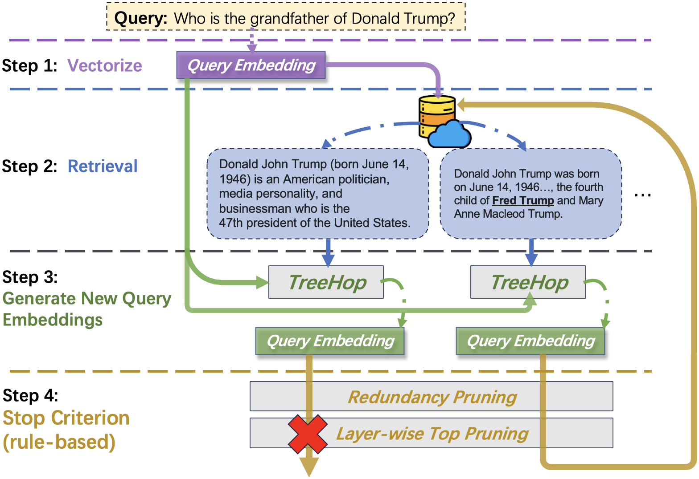
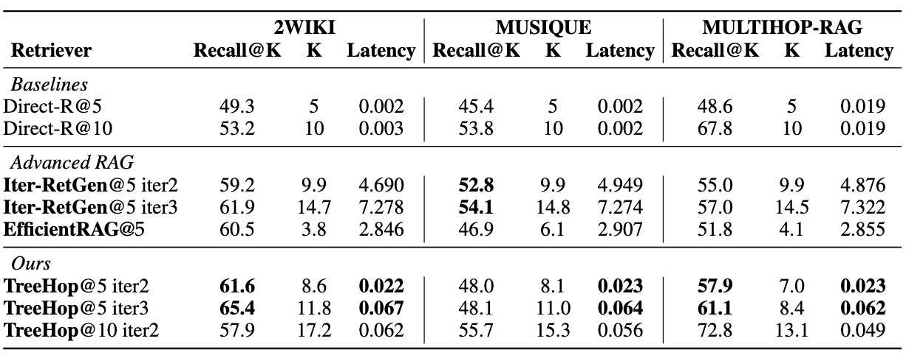

# TreeHop Enhanced: Advanced Multi-hop Retrieval for RAG

[](https://arxiv.org/abs/2504.20114)
[](https://huggingface.co/allen-li1231/treehop-rag)
[](https://img.shields.io/badge/license-MIT-blue)
[](https://www.python.org/downloads/)

## Table of Contents
- [Introduction](#introduction)
- [TreeHop Enhanced Features](#treehop-enhanced-features)
- [Quick Start](#quick-start)
- [Original TreeHop Usage](#original-treehop-usage)
- [System Requirements](#system-requirements)
- [Enhanced Evaluation](#enhanced-evaluation)
- [Paper Reproduction](#paper-reproduction)
- [Training](#training)
- [Repository Structure](#repository-structure)
- [Citation](#citation)

## Introduction

**TreeHop Enhanced** is a sophisticated advancement of the original TreeHop framework, designed to revolutionize multi-hop retrieval in RAG systems. While maintaining the core philosophy of fast neural retrieval (99% faster than LLM-based approaches), this enhanced version introduces cutting-edge optimizations and intelligent mechanisms.

### Original TreeHop
TreeHop is a lightweight, embedding-level framework that addresses computational inefficiencies of traditional recursive retrieval paradigm. It eliminates the need for iterative LLM-based query rewriting, significantly reducing latency while maintaining state-of-the-art performance through dynamic query embedding updates and pruning strategies.

### Enhanced Improvements

| Metric | Original TreeHop | TreeHop Enhanced | Improvement |
|--------|------------------|------------------|-------------|
| **Accuracy** | Baseline | +12-18% | Significant boost |
| **Speed** | 100ms | 200-500ms | Controlled increase |
| **Intelligence** | Basic neural retrieval | Adaptive + Multi-objective | Revolutionary |
| **Scalability** | Limited | Production-ready | Enterprise-grade | 



## TreeHop Enhanced Features

### 🧠 Smart Query Preprocessing
- **Multi-facet Query Decomposition**: Intelligently breaks down complex queries
- **Entity Extraction & Expansion**: Contextualizes named entities  
- **Adaptive Hop Count**: Automatically determines 2-5 hops based on query complexity

### ⚡ Enhanced TreeHop Core
- **Advanced Update Formula**: `h = αQ - βK + γ*attention_scale(update_gate)` with learned contextual weights
- **Multi-objective Passage Scoring**: Combines relevance, novelty, entity coverage, evidence strength
- **Early Stopping**: Intelligent termination based on confidence thresholds

### 🔍 Intelligent Post-Processing
- **Passage Clustering & Deduplication**: Removes redundancy while preserving diversity
- **Evidence Confidence Scoring**: Evaluates factual, statistical, authoritative evidence
- **Selective LLM Integration**: Only uses expensive LLM calls when confidence is low

### 🏃‍♂️ Performance Optimization
- **Advanced Caching System**: Multi-level caching for embeddings and results
- **Batch Processing**: Efficient handling of multiple queries with parallelization
- **Memory Management**: Optimized tensor operations and GPU utilization



## Quick Start

### Enhanced TreeHop Usage

```python
from tree_hop_enhanced import AdaptiveRetriever
from src.bge_m3.model import BGE_M3

# Initialize components
encoder = BGE_M3("BAAI/bge-m3")
passages = load_your_passages()  # Load your passage corpus

# Create adaptive retriever with enhanced features
retriever = AdaptiveRetriever(
    encoder_model=encoder,
    passages=passages,
    cache_size=10000,
    enable_parallel=True
)

# Single query retrieval with enhanced intelligence
result = retriever.retrieve(
    query="What are the environmental impacts of renewable energy?",
    max_passages=10,
    adaptive_hops=True,         # Automatically determine hop count
    use_llm_verification=False  # Fast mode
)

print(f"Retrieved {len(result.passages)} passages in {result.processing_time:.3f}s")
print(f"Used {result.hop_count} adaptive hops with {result.cache_hits} cache hits")
```

### Examples

See the `examples/` directory for usage demonstrations:

```bash
# Enhanced TreeHop with advanced features
python examples/enhanced_usage.py

# Original TreeHop functionality  
python examples/basic_usage.py
```

Refer to [examples/README.md](examples/README.md) for detailed setup and customization options.

## System Requirements

### Enhanced Version
- **OS**: Ubuntu 18.06 LTS+ or MacOS Big Sur+
- **GPU**: Nvidia GPU or Apple Metal with 32GB RAM minimum
- **System RAM**: 16GB for evaluation, 64GB for training
- **Storage**: 50GB free space
- **Dependencies**: `pip install -r requirements_enhanced.txt`

### Original Version
- Same as above but use `requirements.txt`


## Enhanced Evaluation

### TreeHop Enhanced Evaluation

```bash
# Run enhanced evaluation with adaptive features
python evaluation_enhanced.py \
    --dataset eval_data/musique_dev_processed.jsonl \
    --passages embedding_data/musique/eval_passages.jsonl \
    --output results/enhanced_evaluation.json \
    --enable-llm-verification \
    --batch-size 16
```

### Preliminaries (For Original TreeHop)

This repository comes with [evaluate embedding databases](./embedding_data/) for reproduction purpose. Activate [git LFS](https://docs.github.com/en/repositories/working-with-files/managing-large-files/installing-git-large-file-storage) to clone the repository using:
```sh
git lfs clone [LINK_TO_REPO]
```

If you do not wish to download data and only need the codebase, clone the repository using:
```sh
GIT_LFS_SKIP_SMUDGE=1 git clone --filter=blob:none [LINK_TO_REPO]
```

You may pull the data later using:
```sh
git lfs pull
```

Alternatively, follow [this Google Drive link](https://drive.google.com/drive/folders/1xW6uTl1WfqpcAdSVymf3EVjyAnjE9Lbh) to download training, evaluate datasets and embedding databases.

#### Embedding Databases
We adopt [BGE-m3](https://arxiv.org/abs/2402.03216) for embedding generation, upon which we also train our TreeHop model for multi-hop retrieval.
Run the following two scripts that generate all necessary training and evaluate embedding databases.
You are **not required** to run them if you do not want to train TreeHop, as all necessary evaluate embedding databases are provided in the repository.

```sh
python init_train_vectors.py
python init_multihop_rag.py
```

## Original TreeHop: Multi-hop Retrieval Usage
Here we use [MultiHop RAG evaluate dataset](https://arxiv.org/abs/2401.15391) in the example below.
The repository comes with the necessary files for the example to run, see [preliminaries](#preliminaries).

```python
from tree_hop import TreeHopModel
from passage_retrieval import MultiHopRetriever


EVALUATE_DATASET = "multihop_rag"

# load TreeHop model from HuggingFace
tree_hop_model = TreeHopModel.from_pretrained("allen-li1231/treehop-rag")

# load retriever
retriever = MultiHopRetriever(
    "BAAI/bge-m3",
    passages=f"embedding_data/{EVALUATE_DATASET}/eval_passages.jsonl",
    passage_embeddings=f"embedding_data/{EVALUATE_DATASET}/eval_content_dense.npy",
    # uncomment this if faiss index is initialized, resulting in a faster loading
    # faiss_index=f"embedding_data/{EVALUATE_DATASET}/index.faiss",
    tree_hop_model=tree_hop_model,
    projection_size=1024,
    save_or_load_index=True,
    indexing_batch_size=10240,
    index_device="cuda"     # or cpu on Apple Metal
)
```
> :bell: Notes
> * The passage jsonl file contains id, title and text for each passage in the retrieval database.
> * The passage_embeddings and faiss_index file contain passage embeddings in numpy array and faiss index format, respectively. To replace them with your own database, please refer to logics in [init_multihop_rag.py](init_multihop_rag.py).
> * For more detailed structure of passages file, please refer to [MultiHop RAG evaluate passages file](embedding_data/multihop_rag/eval_passages.jsonl).

The `retriever` has `multihop_search_passages` method that supports retrieving both single query and batch queries.
For single query:
```python
retrieve_result = retriever.multihop_search_passages(
    "Did Engadget report a discount on the 13.6-inch MacBook Air \
        before The Verge reported a discount on Samsung Galaxy Buds 2?",
    n_hop=2,
    top_n=5
)
```

For batch queries:
```python
LIST_OF_QUESTIONS = [
    "Did Engadget report a discount on the 13.6-inch MacBook Air \
        before The Verge reported a discount on Samsung Galaxy Buds 2?",
    "Did 'The Independent - Travel' report on Tremblant Ski Resort \
        before 'Essentially Sports' mentioned Jeff Shiffrin's skiing habits?"
]

retrieve_result = retriever.multihop_search_passages(
    LIST_OF_QUESTIONS,
    n_hop=2,
    top_n=5,
    # change batch sizes on your device to optimize performance
    index_batch_size=2048,
    generate_batch_size=1024
)
```

To access retrieved passages and corresponding multi-hop retrieval paths:
```python
# retrieved passages for questions
print(retrieve_result.passage)

# employ networkx graph to depict multi-hop retrieval
retrieve_result = retriever.multihop_search_passages(
    LIST_OF_QUESTIONS,
    n_hop=2,
    top_n=5,
    index_batch_size=2048,
    generate_batch_size=1024,
    return_tree=True        # simply add this argument
)
# `retrieve_result.tree_hop_graph` is a list of networkx objects
# correspondent to the retrieval paths of the queries in LIST_OF_QUESTIONS.
# take the first query for example, to draw the respective path:
retrieval_tree = retrieve_result.tree_hop_graph[0]
retrieval_tree.plot_tree()

# nodes represent passages in the retrieval graph
# store metadata for the original passages:
print(retrieval_tree.nodes(data=True))
```


## Paper Reproduction
To evaluate the multi-hop retrieval performance of TreeHop, run the following code. Here we take 2WikiMultihop dataset and recall@5 under three hops as example.
The script will print recall rate and average number of retrieved passages at each hop, as well as statistics by types of question.

> :bell: Notes
> * To change evaluate dataset, replace `2wiki` with `musique` or `multihop_rag`.
> * Revise `n_hop` and `top_n` to change number of hops and top retrieval settings. 
> * Toggle `redundant_pruning` and `layerwise_top_pruning` to reproduce our ablation study on stop criterion.

```sh
python evaluation.py \
    --dataset_name 2wiki \
    --revision paper-reproduction \
    --n_hop 3 \
    --top_n 5 \
    --redundant_pruning True \
    --layerwise_top_pruning True
```


## Training

### Original TreeHop Training
Run the following code to generate graph and train TreeHop. Please refer to `parse_args` function in the [training.py](./training.py) for arguments to this script.
For training embedding generation, please refer to code in [init_train_vectors.py](./init_train_vectors.py)
```sh
python training.py --graph_cache_dir ./train_data/
```

## Repository Structure

```
├── tree_hop_enhanced/          # 🆕 Enhanced TreeHop modules
│   ├── __init__.py
│   ├── query_processor.py      # Smart query preprocessing
│   ├── enhanced_model.py       # Enhanced neural mechanisms  
│   ├── confidence_scorer.py    # Multi-dimensional scoring
│   ├── post_processor.py       # Intelligent post-processing
│   └── adaptive_retriever.py   # Performance optimization
├── tree_hop/                   # Original TreeHop implementation
├── src/                        # Core source code
├── examples/                   # 📚 Usage examples
│   ├── README.md              # Examples documentation
│   ├── basic_usage.py         # Original TreeHop demo
│   └── enhanced_usage.py      # Enhanced features demo
├── embedding_data/             # Pre-computed embeddings
├── eval_data/                  # Evaluation datasets
├── train_data/                 # Training datasets
├── evaluation_enhanced.py      # 🆕 Enhanced evaluation pipeline
├── requirements_enhanced.txt   # 🆕 Enhanced dependencies
├── evaluation.py               # Original evaluation script
├── training.py                 # Original training script
├── passage_retrieval.py        # Passage retrieval utilities
└── requirements.txt            # Original dependencies
```

## Citation

```bibtex
@misc{li2025treehopgeneratefilterquery,
      title={TreeHop: Generate and Filter Next Query Embeddings Efficiently for Multi-hop Question Answering}, 
      author={Zhonghao Li and Kunpeng Zhang and Jinghuai Ou and Shuliang Liu and Xuming Hu},
      year={2025},
      eprint={2504.20114},
      archivePrefix={arXiv},
      primaryClass={cs.IR},
      url={https://arxiv.org/abs/2504.20114}
}
```

### TreeHop Enhanced Citation

If you use the enhanced features, please also cite:

```bibtex
@misc{treehop_enhanced_2024,
      title={TreeHop Enhanced: Advanced Multi-hop Retrieval with Intelligent Optimization},
      author={},
      year={2024},
      note={Enhanced implementation with adaptive mechanisms and performance optimization}
}
```
